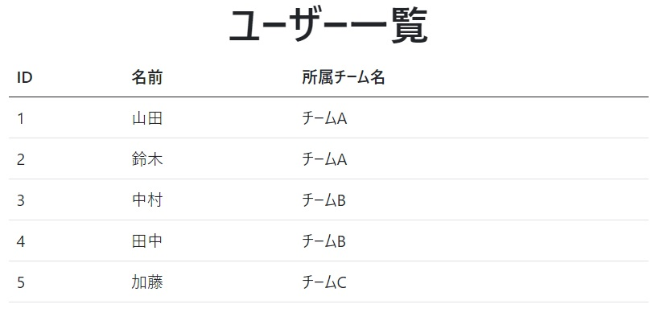

<h1>Django練習課題</h1>

<h2>Djangoプロジェクトの作成</h2>
以下の内容でプロジェクトを作成してください。 

ディレクトリ名：djangoExersise 
プロジェクト名：djangoExersise 
アプリケーション名：katachi 
仮想環境名：katachiDjango 
必要なパッケージ：Django 3.2.10

またこのプロジェクトを実行し、URL「<a>http://127.0.0.1:8000/</a>」でindex.htmlを表示してください。以下のような画面が表示されたら問題ありません。

<h2>トップページを作りましょう</h2>
URLで<a>http://127.0.0.1:8000/</a>にアクセスした時に、h1タグを使って<b>Hello Django</b>と以下のような画面が表示されるようにしてください。

<h2>画面遷移をしてみましょう</h2>
名前の入力欄と送信ボタンをもつ画面input.htmlを用意し、URL「<a>http://127.0.0.1:8000/input</a>」で表示してください。 
またindex.htmlで表示したh1タグのところをURLへのリンクに変更し、<a>http://127.0.0.1:8000/</a>からinputの画面に遷移するようにしてください。以下のように遷移できていれば問題ありません。

<h2>GETパラメータを使ってみましょう</h2>
「<a>http://127.0.0.1:8000/input?name=foo</a>」のようにしてnameというパラメータに値を渡した時にその値が入力された状態で表示するようにしてください。

<h2>POSTパラメータを使ってみましょう</h2>
input.htmlの送信ボタンを押すと、"/input"にPOSTリクエストを送信し、profile.htmlを表示してください。profile.htmlでは入力欄ではなく表示だけするようにしてください。

<h2>フォームを使ったプロフィール登録画面を考えてみましょう</h2>
input.htmlに以下のフォームコントロールを追加して、名前と同様に各入力値をprofile.htmlで表示できるようにしましょう。ラジオボタン、ドロップボックス、チェックボックスなどの選択可能なコントロールの各値については、HTMLファイルで直で書かずに、Pythonのコード内で定義してみましょう。

＊ Bootstrapで見た目を整うように工夫してください
<ul>
    <li>誕生日（日付選択タイプ）</li>
    <li>性別（ラジオボタン）
        <ul>
            <li>「男性/女性/その他」のいずれかを選択できるようにする</li>
        </ul>
    </li>
    <li>血液型（ドロップダウンリスト）
        <ul>
            <li>「A型/B型/O型/AB型/不明」のいずれかを選択できるようにする</li>
        </ul>
    </li>
    <li>学習内容（チェックボックス）
        <ul>
            <li>「Java/PHP/HTML/デザイン/その他」から複数選択出来るようにする</li>
        </ul>
    </li>
    <li>備考（テキストエリア）
        <ul>
            <li>複数行の文章を入力できる</li>
        </ul>
    </li>
</ul>
以下のように表示できていれば問題ありません。

<h2>入力内容に間違いがないかバリデーションしましょう</h2>
input.htmlの送信ボタンを押下時に以下の入力値チェック（バリデーション）を行ってください。バリデーションエラー時にはinput.htmlに戻って入力項目ごとにエラーメッセージを表示し、再入力できるようにしてください。入力欄には入力していた値がそのまま残っているようにしてください。
<ul>
    <li>名前</li>
    <ul>
        <li>必ず入力されていること（空欄不可）</li>
    </ul>
    <li>誕生日</li>
    <ul>
        <li>必ず入力されていること（空欄不可）</li>
        <li>正しい日付であること</li>
    </ul>
    <li>性別</li>
    <ul>
        <li>必ず選択されていること</li>
    </ul>
    <li>学習内容</li>
    <ul>
        <li>何か一つは必ず選択されていること</li>
    </ul>
    <li>備考</li>
    <ul>
        <li>必ず入力されていること（空欄不可）</li>
        <li>100文字以内であること</li>
    </ul>
</ul>

<h2>データベース</h2>
SQLiteを使って、「db.sqlite3」という名前のデータベースに以下の２つのテーブルを作成してください。
<table>
    <thead>
        <tr>
            <th>列名</td>
            <td>型（桁）</td>
            <td>制約等</td>
            <td>備考</td>
        </tr>
    </thead>
    <tbody>
        <tr>
            <th>id</th>
            <td>INT</td>
            <td>PRIMARY KEY, AUTO_INCREMENT</td>
            <td>チームID</td>
        </tr>
        <tr>
            <th>name</th>
            <td>VARCHAR(50)</td>
            <td>NOT NULL</td>
            <td>チーム名</td>
        </tr>
    </tbody>
</table>

テーブル１：teams

<table>
    <thead>
        <tr>
            <th>列名</td>
            <td>型（桁）</td>
            <td>制約等</td>
            <td>備考</td>
        </tr>
    </thead>
    <tbody>
        <tr>
            <th>id</th>
            <td>INT</td>
            <td>PRIMARY KEY, AUTO_INCREMENT</td>
            <td>ユーザーID</td>
        </tr>
        <tr>
            <th>team_id</th>
            <td>INT</td>
            <td>NOT NULL</td>
            <td>チームID</td>
        </tr>
        <tr>
            <th>name</th>
            <td>VARCHAR(50)</td>
            <td>NOT NULL</td>
            <td>ユーザー名</td>
        </tr>
    </tbody>
</table>

テーブル２：users

またそれぞれのテーブルに以下のレコードを追加してください。

<table>
    <thead>
        <tr>
            <td>id</td>
            <td>name</td>
        </tr>
    </thead>
    <tbody>
        <tr><td>1</td><td>チームA</td></tr>
        <tr><td>2</td><td>チームB</td></tr>
        <tr><td>3</td><td>チームC</td></tr>
        <tr><td>4</td><td>チームD</td></tr>
    </tbody>
</table>

teamsテーブル

<table>
    <thead>
        <tr>
            <td>id</td>
            <td>name</td>
        </tr>
    </thead>
    <tbody>
        <tr><td>1</td><td>チームA</td></tr>
        <tr><td>2</td><td>チームB</td></tr>
        <tr><td>3</td><td>チームC</td></tr>
        <tr><td>4</td><td>チームD</td></tr>
    </tbody>
</table>

usersテーブル

<h2>プロジェクトからデータベースの利用</h2>
URLで<a>http://127.0.0.1:8000/user</a>にアクセスすると、ユーザー一覧画面が表示されるようにして下さい。ユーザー一覧画面では、データベース「db.sqlite3」に登録されている全ユーザーのユーザーID、名前、所属チーム名が表示されるようにしてみて下さい。 
以下のように表示されていれば、問題ありません。

<h2>ユーザー登録</h2>
URLで<a>http://127.0.0.1:8000/user/add</a>でユーザー登録画面を表示してください。
<ul>
    <li>登録内容はチーム名と名前です。名前はテキストボックス、チーム名はドロップダウンリストで選択できるようにしてください。登録ボタンを押すとusersテーブルにデータが追加されるようにしてください。</li>
    <li>登録に成功したら、ユーザ一覧画面にリダイレクトして、登録したユーザーも含めて一覧に表示するようにしてください。</li>
    <li>名前が未入力、またはすでに同じ名前が登録されていた場合は、入力エラーとして、ユーザ登録画面でエラーメッセージを表示してください。</li>
</ul>

<h2>ユーザー削除</h2>
URLでhttp://127.0.0.1:8000/user/delete/{ユーザーのID}でユーザーを削除してください。
{ユーザーのID}のところにIDを入れて、リクエストすると、usersテーブルから該当のユーザーを削除し、ユーザ一覧画面にリダイレクトして下さい。またユーザ一覧から削除できるようにユーザー毎にリンクボタンを設置してください。